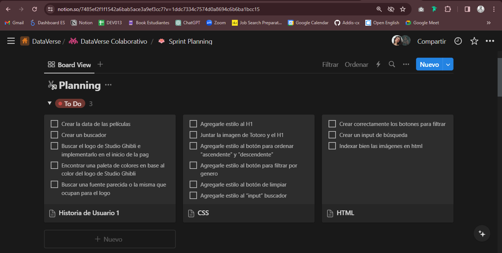
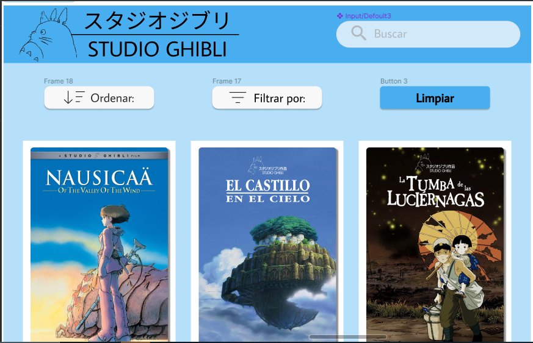
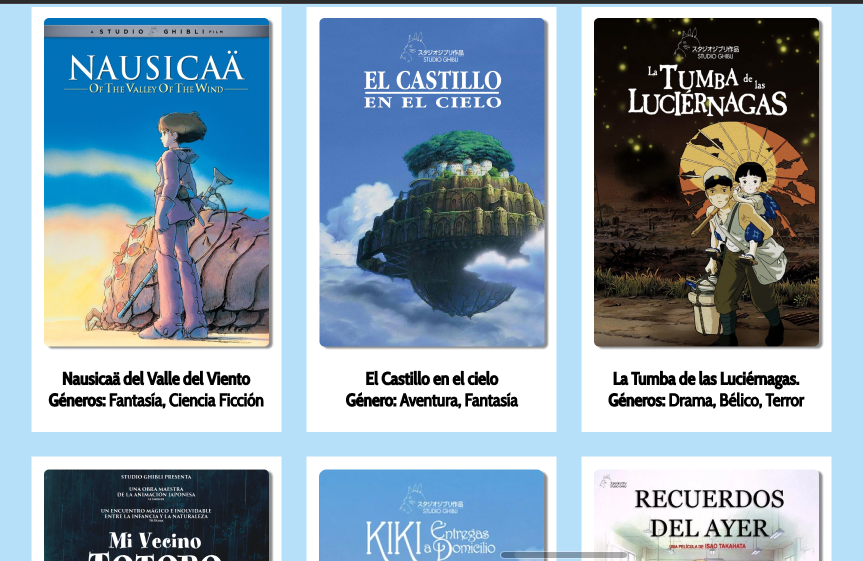
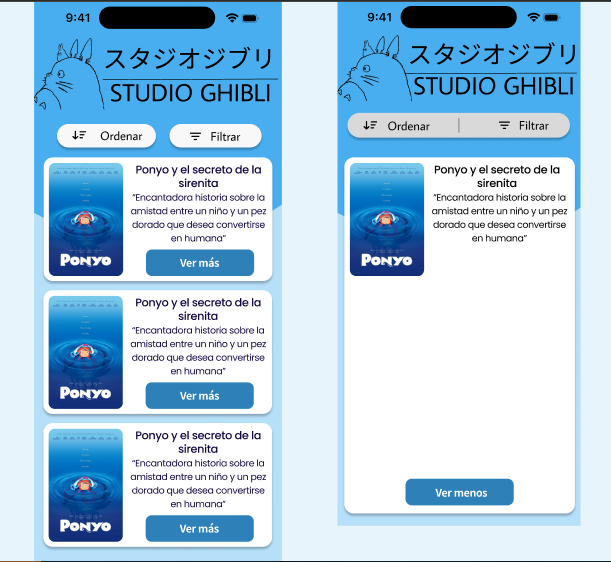

# Dataverse

## Índice

* [1. Definición del Proyecto](#1-definición-del-proyecto)
* [2. Funcionalidad](#2-funcionalidad)
* [3. Historias de Usuario](#3-historias-de-usuario)
* [4. Diseño de Interfaz de Usuaria](#4-diseño-de-interfaz-de-usuaria)
* [5. Listado de Problemas Detectados a través de Test de Usabilidad](#5-listado-de-problemas-detectados-a-través-de-test-de-usabilidad)
* [6. Prompt Utilizado para Generar los Datos](#6-prompt-utilizado-para-generar-los-datos)

***

## 1. Definición del Proyecto

Este proyecto ha dado origen a una página web informativa que se centra en las películas de Studio Ghibli. En ella, se puede acceder a un conjunto de datos creados con ayuda de la inteligencia artificial ChatGPT que incluyen detalles como el año de publicación, los géneros, y una breve descripción de cada película. Este recurso se ha diseñado para ofrecer una visión general y accesible de las maravillosas creaciones de Studio Ghibli, facilitando así a los aficionados la búsqueda de información sobre estas aclamadas obras cinematográficas.

 

## 2. Funcionalidad

La página web está equipada con un buscador que facilita la búsqueda de películas. Además, ofrece la capacidad de filtrar, ordenar y ver estadísticas, así como la opción de limpiar o resetear la página. 

Para visualizar la data generada por ChatGPT, se ha implementado un componente UI conocido como 'tarjeta' (card), el cual resalta los valores de las propiedades de la data que son de interés para lxs usuarixs, tales como imagen, nombre y géneros.

 ### Filtrado
  
  - Esta función opera sobre la data ya ordenada, ya sea en orden ascendente o descendente.
  - El filtro facilita la búsqueda de películas, permitiendo a los usuarios filtrar por género:
   + Acción.
   + Romance.
   + Fantasía.
   + Ciencia Ficción.
   + Terror.
   + Bélico.
   + Suspenso.
   + Infantil.
   + Familia.
   + Comedia.
   + Drama.
   + Aventura.
   + Misterio.

 ### Ordenado
  
  - Los usuarios pueden ordenar las películas alfabéticamente de A-Z o de Z-A. Esto se realiza a través de la propiedad de nombre de la película, permitiendo a los usuarios ver la data ordenada de manera ascendente (A-Z) o descendente (Z-A).
  - Esta funcion reinicia la funcion de filtradEsta función restablece el filtro de género, permitiendo a los usuarios reiniciar la búsqueda de películas por género.

 ### Estadística 
  
  - Al hacer clic en el botón de estadísticas, se muestra una ventana emergente que presenta una estadística para cada género, indicando la cantidad de películas que tienen ese género. Esta función proporciona a los usuarios una visión general de la distribución de géneros dentro del catálogo de películas, permitiéndoles obtener información valiosa sobre las tendencias en el contenido del sitio web."

 ### Limpiar

 - Se ha añadido el botón de 'Limpiar', el cual permite a los usuarios restablecer la página web eliminando las búsquedas previas, filtros, ordenamientos y estadísticas.

## 3. Historias de Usuario

 ### Historia de Usuaria N°1:

  Como fan de Studio Ghibli, deseo una lista de películas en la plataforma con información clara y precisa.

  - Criterios de aceptación de la usuaria:

   + La información debe estar en español.
   + Deseo que haya un buscador que permita encontrar una película específica.
   + Quiero que sea fiel al estilo distintivo de Studio Ghibli.
   + Prefiero que los colores de la página sean suaves, complementando el rico estilo visual de las películas.

  - Definición de terminado:

   + Se generó la data en español y se creó un buscador funcional.
   + La paleta de colores se inspiró en el azul celeste del logo.
   + Se realizaron pruebas exhaustivas de fuentes para asegurar una experiencia visual óptima.
   + Se consultó con usuarios habituales de películas de Studio Ghibli para obtener retroalimentación sobre la usabilidad y el diseño.

   

### Historia de Usuaria N°2

 Como fanático del anime y del trabajo cinematográfico de Studio Ghibli, espero que la página facilite la visualización de películas mediante algún filtro, con portadas como tema principal y poca información. Si deseo conocer más detalles sobre una película en específico, simplemente debería seleccionarla y aparecerá la información restante.

 - Criterios de aceptación de la usuaria:

  + La página debe contar con un botón para filtrar por géneros.
  + Un botón para ordenar alfabéticamente de manera ascendente (A-Z) y descendente (Z-A).
  + Se debe incluir un botón para reiniciar la página.
  + La portada de cada película debe ser el elemento principal y visible.
  + Se debe incluir un botón para acceder a la información detallada de cada película, que se mostrará en una ventana emergente.
 
 - Definición de Terminado:

  + Se han añadido los botones necesarios para filtrar por géneros y ordenar alfabéticamente.
  + Las portadas de las películas son el elemento principal y visible.
  + Se ha creado una ventana emergente con la información detallada de cada película.
  + Se ha implementado un botón para reiniciar la página y restablecer los filtros y ordenamientos.

  

## 4. Diseño de Interfaz de Usuaria

Para realizar el prototipado realizamos UX (User Experience) para iniciar haciendo la investigacion de usuario, viendo otras plataformas de pelicula o de anime y asi validar lo siguiente:

¿Quiénes son las principales usuarias del producto?

En el proceso de prototipado, llevamos a cabo una minuciosa investigación de usuarios mediante la metodología de User Experience (UX). Este enfoque nos permitió adentrarnos en las necesidades y preferencias de nuestra audiencia potencial, explorando otras plataformas de películas y de anime como referentes.

 ### Perfil de la usuaria:
  - Nuestro público objetivo se compone de personas apasionadas por el trabajo cinematográfico de Studio Ghibli o por el anime en general. Estas usuarias disfrutan ver películas o series animadas en línea, ya sea a través de dispositivos móviles o de escritorio.

 ### Objetivos de las usuarias:
  - Las principales metas de nuestras usuarias incluyen:

   + Explorar un listado completo de las películas disponibles, con sus respectivas portadas.
   + Poder ordenar el listado de películas de manera ascendente (A-Z) y descendente (Z-A).
   + Filtrar las películas por género, para así encontrar más fácilmente aquellos títulos que se ajusten a sus preferencias.
   + Contar con un botón para restablecer los filtros y ordenamientos, simplificando la navegación.

 ### Datos relevantes en la interfaz:
  - En la interfaz de usuario, hemos destacado la importancia de:

   + Presentar el nombre de la película de manera clara, ya que es uno de los principales puntos de búsqueda para las usuarias.
   + Incluir el género de la película, pues permite a las usuarias realizar una selección más precisa y acorde a sus preferencias personales.

Para materializar estas ideas y comprobar su viabilidad, hemos desarrollado un prototipo inicial de baja fidelidad. Este prototipo, que se ajusta a la primera historia de usuario, servirá como base para posteriores iteraciones, adaptándose siempre a la evolución de la experiencia de la usuaria.

Basándonos en el valioso feedback proporcionado por nuestras usuarias, hemos realizado ajustes significativos en el diseño de nuestro prototipo. El resultado final es una versión que satisface las necesidades y expectativas de nuestras usuarias de manera más efectiva y eficiente.

**Prototipo para Desktop**

 

**Vista de la Tarjeta con información detallada**

**Prototipo para Moviles**

## 5. Listado de Problemas Detectados a través de Test de Usabilidad

 - Inicialmente, optamos por una paleta de colores verdes, pero después de revisar nuestra historia de usuario, concluimos que no era la elección más adecuada. El verde no reflejaba fielmente el estilo de Studio Ghibli, por lo que decidimos explorar otras opciones.

 - Además, notamos que el contenedor blanco de las tarjetas era demasiado pequeño, lo que daba una apariencia rígida sin ningún borde. Este diseño no contribuía a crear una experiencia visual agradable y amigable.

 - Para mejorar la funcionalidad y la experiencia del usuario, identificamos la necesidad de incorporar dos botones adicionales: uno para acceder a las estadísticas y otro para ver la información detallada de cada película. Estos botones permitirían a las usuarias acceder fácilmente a la información que necesitan, sin necesidad de navegar por múltiples páginas o secciones.

## 6. Prompt Utilizado para Generar los Datos

 - Para generar el dataset, empleamos a nuestro mayordomo ChatGPT, cuya colaboración fue fundamental. ChatGPT nos guió a través de una serie de 'promptings' que sirvieron como punto de partida para la generación de los datos. Estos 'promptings' incluían preguntas y temas relacionados con las películas de Studio Ghibli, como el año de estreno, el género, la trama, y otros detalles relevantes. Luego, con la ayuda de ChatGPT, expandimos y enriquecimos esta información inicial, creando un dataset completo y detallado que abarca todas las películas de Studio Ghibli.

 - Para la generación de imágenes en nuestro caso, al tratarse de datos ya existentes, procedimos a buscar en la plataforma Pinterest. Esta herramienta funciona como un buscador de imágenes (https://www.pinterest.com/) que nos permitió encontrar una amplia variedad de imágenes relacionadas con las películas de Studio Ghibli. Luego, seleccionamos cuidadosamente las imágenes más representativas y de mayor calidad para incorporarlas en nuestro dataset.  